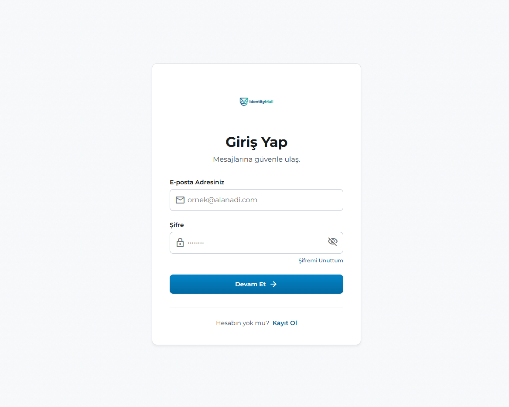
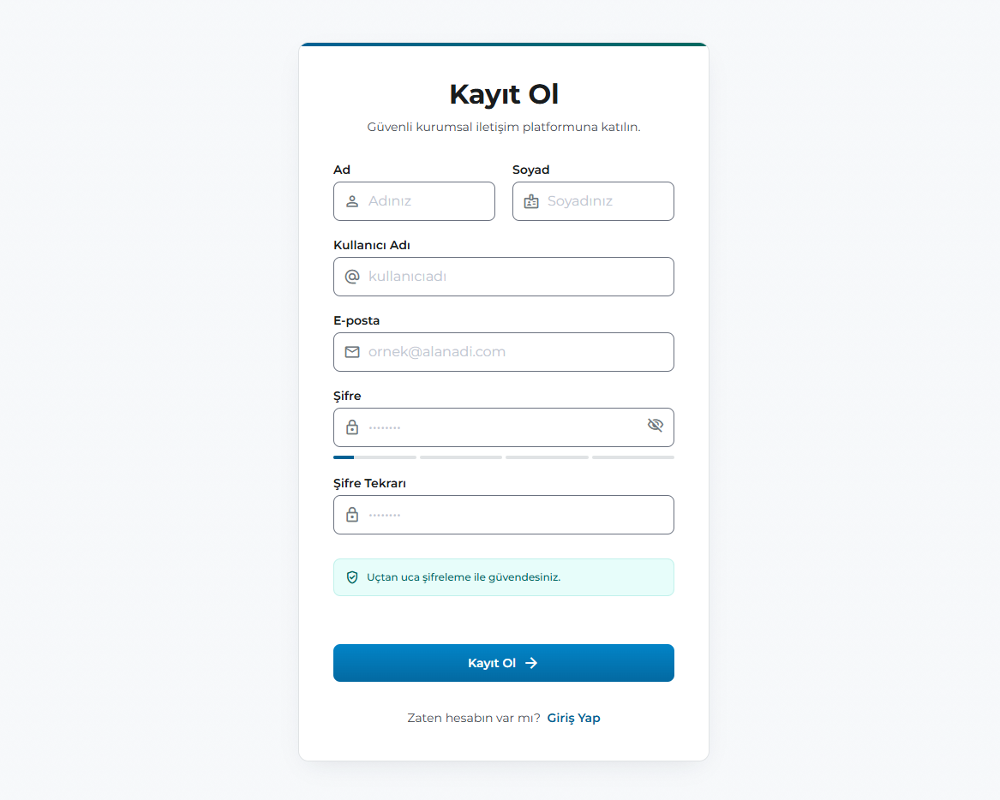
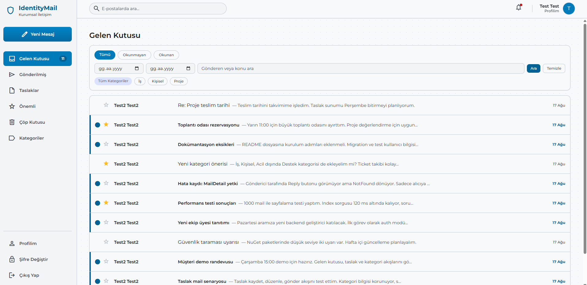
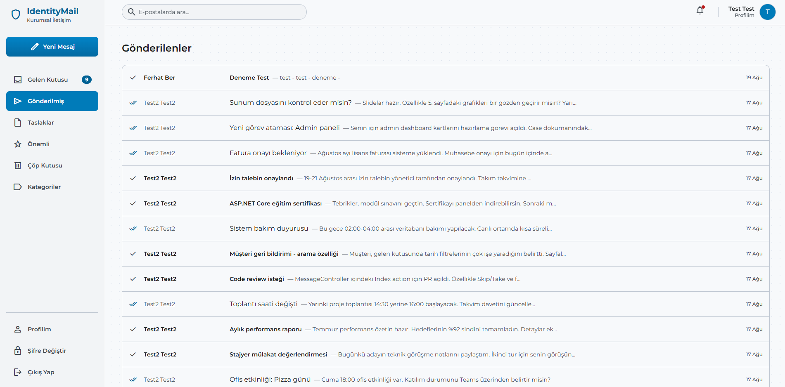
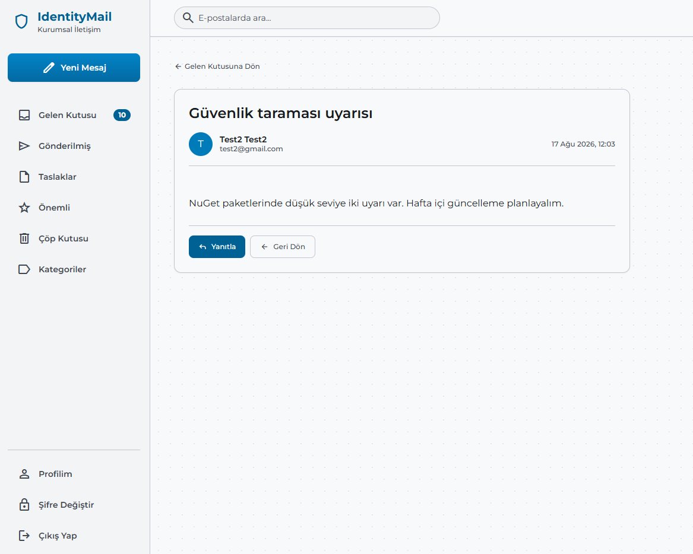
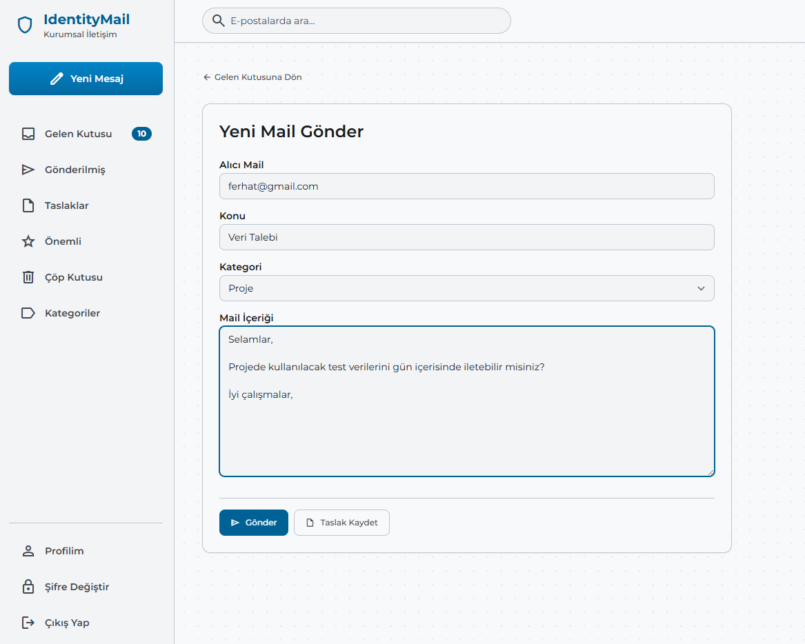
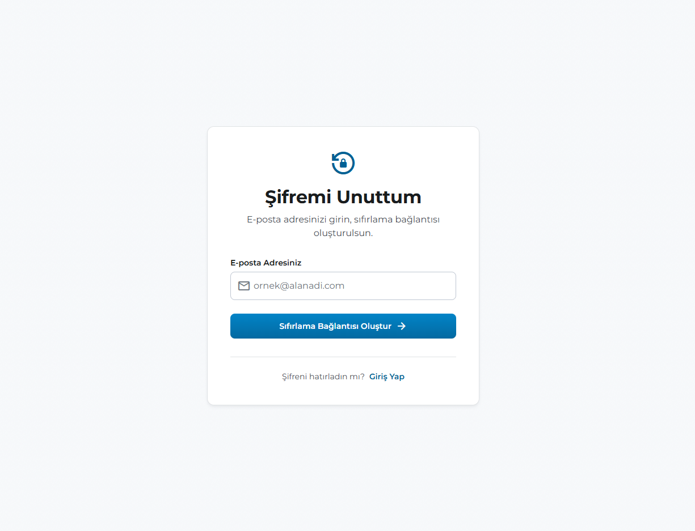
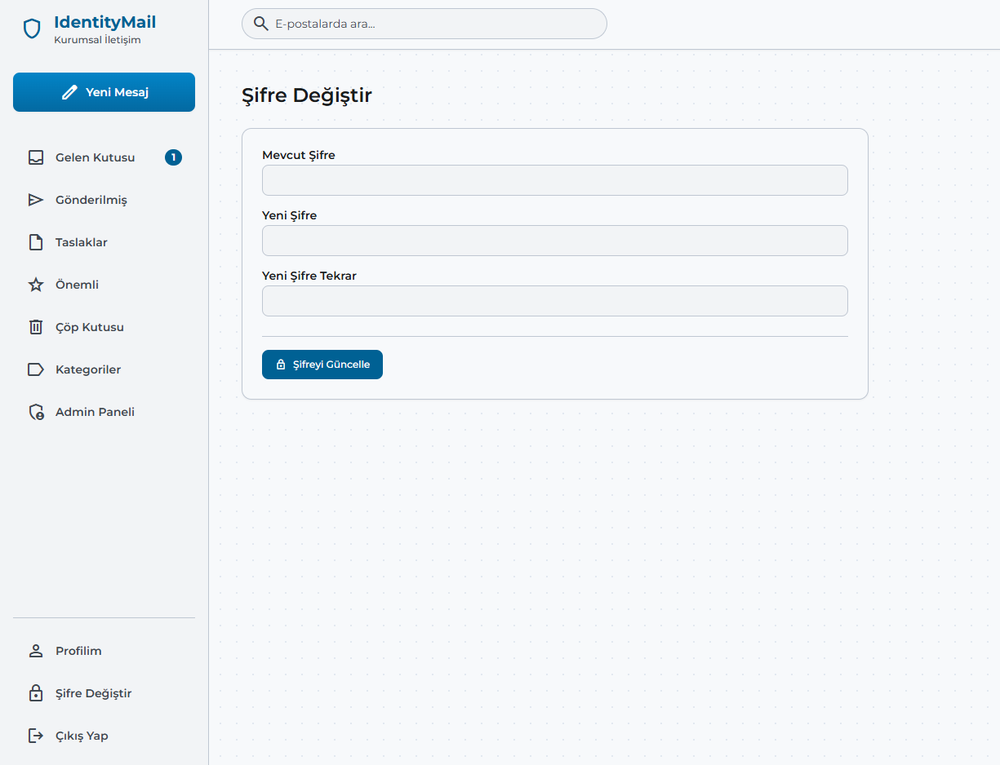
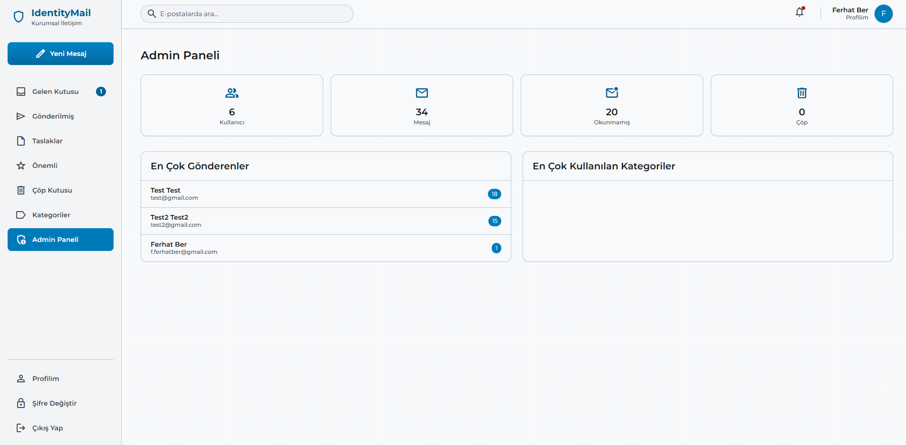

# IdentityMail — Kurumsal Mail Uygulaması

ASP.NET Core Identity altyapısı üzerine kurulmuş, kullanıcılar arası mesajlaşma, taslak yönetimi, kategori filtreleme ve rol bazlı yetkilendirme içeren kurumsal mail uygulamasıdır.

## Özellikler

- ASP.NET Core Identity ile kayıt, giriş, çıkış ve profil yönetimi
- Kullanıcılar arası mail gönderme ve gelen kutusu
- Okundu / okunmamış takibi (mavi şerit + kalın yazı)
- Önemli (yıldızlı) mesaj işaretleme
- Taslak kaydetme, düzenleme ve gönderme
- Çöp kutusuna taşıma ve geri yükleme
- Kategori oluşturma ve maillere kategori atama
- Gelen kutusunda filtre (tümü / okunmayan / okunan), kategori, arama ve tarih aralığı
- Sayfalama (pagination) — sayfa başı 10 mail
- Yanıtlama (reply)
- Admin paneli: kullanıcı sayısı, mesaj istatistikleri, en çok göndericiler, en çok kullanılan kategoriler
- Rol bazlı yetkilendirme: User ve Admin rolleri
- Sidebar'da okunmamış mesaj sayısı (ViewComponent)
- Profil düzenleme ve şifre değiştirme
- Stitch UI tasarım sistemi ile modern, responsive arayüz

## Kullanılan Teknolojiler

- ASP.NET Core MVC (.NET 8)
- ASP.NET Core Identity
- Entity Framework Core (Code First)
- Microsoft SQL Server
- Tailwind CSS (CDN)
- Material Symbols
- Montserrat (Google Fonts)

## Kurulum

1. Projeyi bilgisayarınıza indirin:

```bash
git clone https://github.com/berferhat/myacademy-identitymail-project.git
```

2. `IdentityMailWeb/Program.cs` dosyasındaki bağlantı cümlesini kendi SQL Server ortamınıza göre düzenleyin.

3. Proje klasöründe migration'ları uygulayın:

```bash
cd IdentityMailWeb
dotnet ef database update
```

4. Uygulamayı çalıştırın:

```bash
dotnet run
```

5. Tarayıcıdan terminalde görünen yerel adresi açın.

> İlk kullanıcı Register sayfasından oluşturulur. Admin yetkisi vermek için veritabanında `AspNetUserRoles` tablosuna Admin rolü atanmalıdır.

## Ekran Görüntüleri

### Giriş Sayfası



### Kayıt Sayfası



### Gelen Kutusu



### Gönderilenler



### Mail Detay



### Yeni Mail Gönder



### Şifremi Unuttum



### Şifre Değiştir



### Admin Paneli



## Öğrenilen Konular

- ASP.NET Core Identity ile kimlik doğrulama ve yetkilendirme
- Rol bazlı erişim kontrolü (User / Admin)
- Entity Framework Core ile Code First ve migration yönetimi
- DTO (Data Transfer Object) deseni
- ViewComponent ile tekrar kullanılabilir UI bileşenleri
- Razor view'larda koşullu stil (okundu/okunmamış, yıldız, kategori rozeti)
- Query string ile çoklu filtre, arama, tarih aralığı ve sayfalama
- Layout sistemi ile farklı sayfa çerçeveleri (_AuthLayout, _MailLayout)
- Tailwind CSS ile utility-first responsive tasarım
- Tag Helper kullanımı (asp-for, asp-action, asp-controller)
